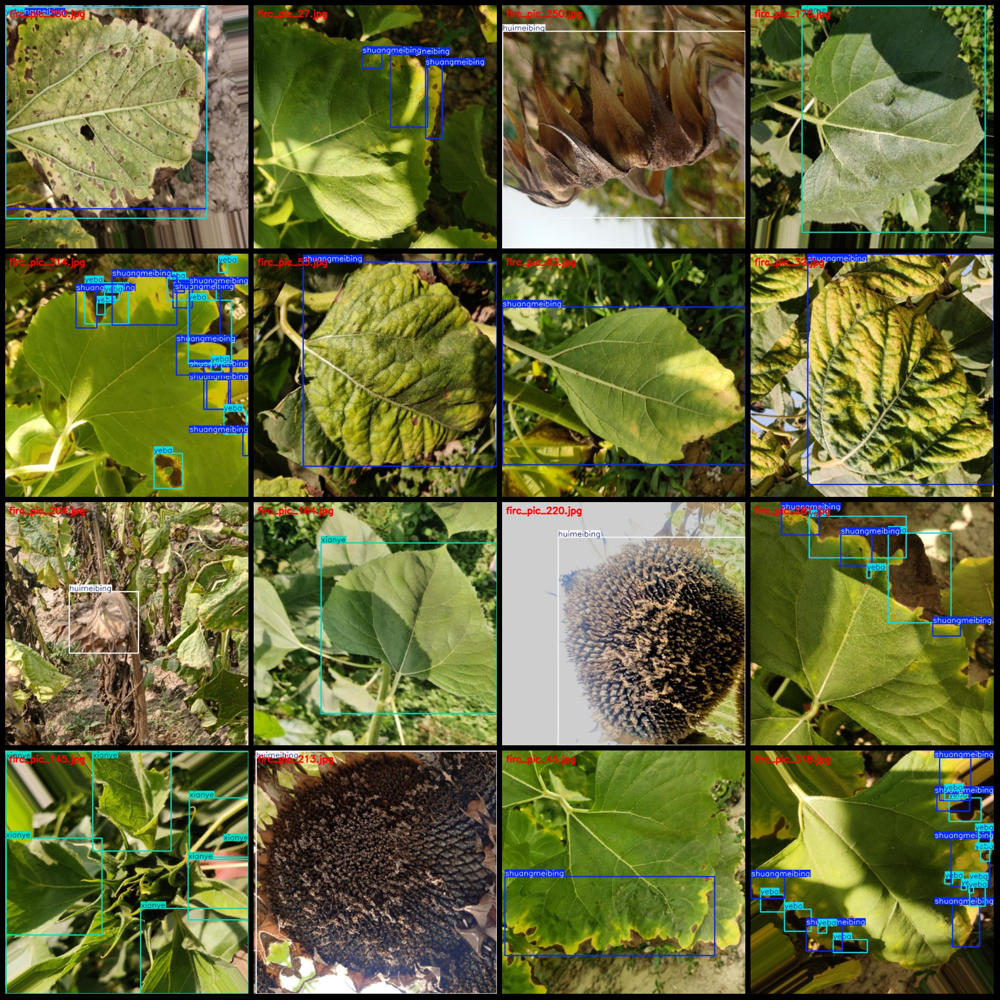
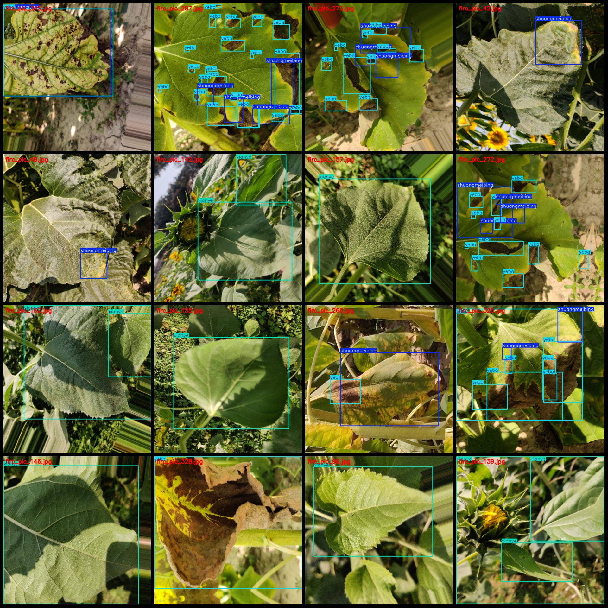

# Sunflower Leaf Disease Detection Dataset (VOC+YOLO format) - 353 Images, 4 Classes

Dataset format: Pascal VOC format + YOLO format (txt file without split path, only containing jpg images and corresponding VOC format xml files and YOLO format txt files).
Number of images (jpg file count): 353
Number of annotations (xml file count): 353
Number of annotations (txt file count): 353
Number of annotation categories: 4
Annotation category names (note that the YOLO format category order does not correspond with this, but is based on the labels folder's "classes.txt" file): ["huimeibing", "shuangmeibing", "xianye", 
"yeba"]
Corresponding Chinese category names: ["gray mold", "freeze mold", "fresh leaf", "leaf scar"]
Boxes per category:
- Huimeibing boxes = 71
- Shuangmeibing boxes = 499
- Xianye boxes = 133
- Yeba boxes = 792
Total boxes: 1495
Number of images per category:
- Huimeibing images = 71
- Shuangmeibing images = 152
- Xianye images = 106
- Yeba images = 101
Image resolution: 640x640
Annotation tool used: labelImg
Annotation rule: draw boxes for each class
Important note: The dataset does not have a division into training, validation, or test sets; you will need to divide them yourself.
Special declaration: This dataset does not guarantee any accuracy in the trained models or weight files.
Image preview:

## Images

Here is a pay link on Stripe ( https://buy.stripe.com/3cs8yP7sY87d0vu9AB ). Please contact me lonlonago@foxmail.com after funding $89, and I will send you a complete data files , thank you!

